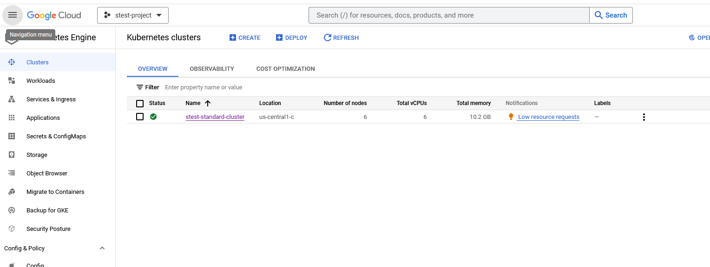
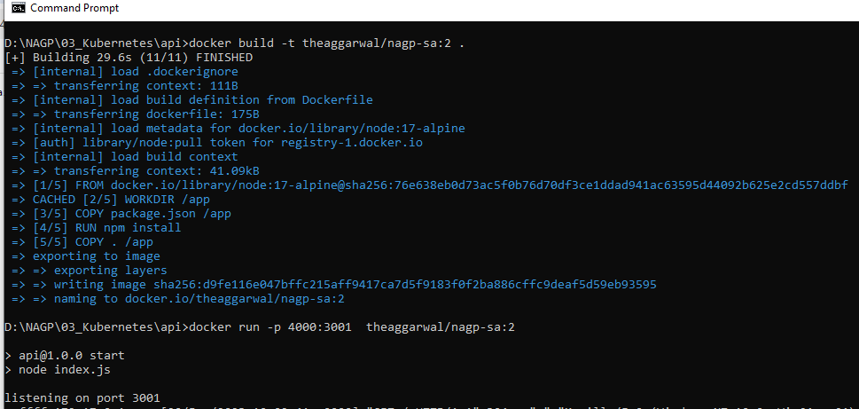
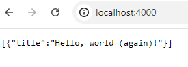
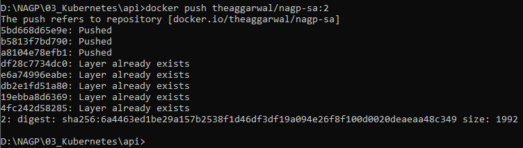
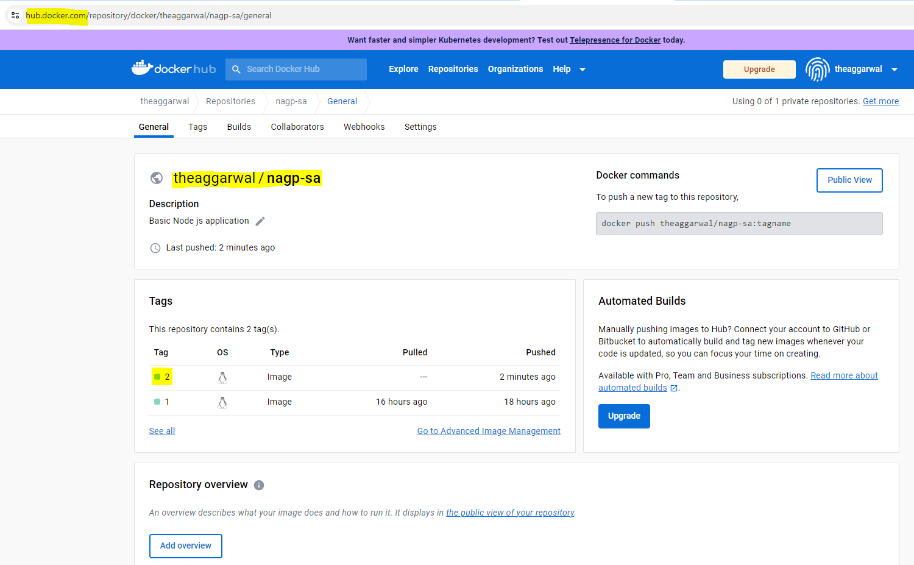
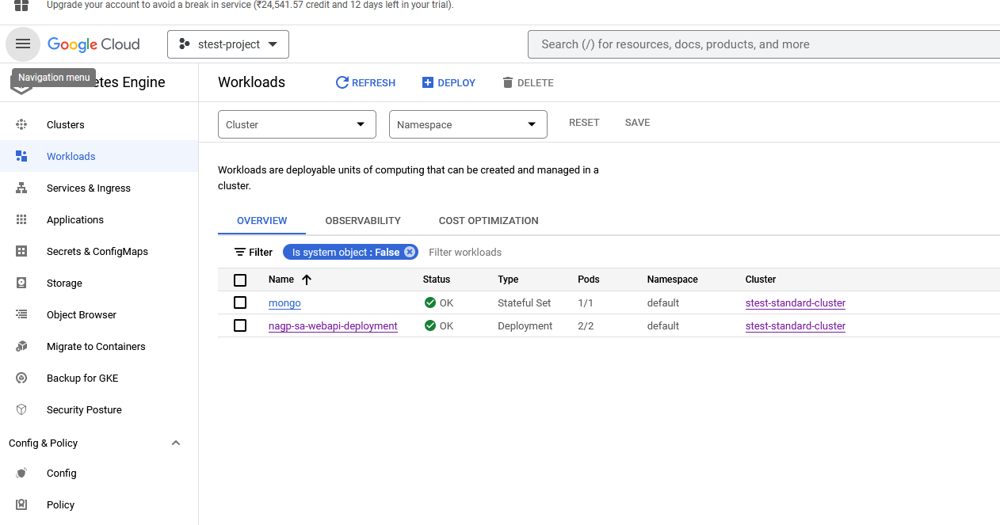
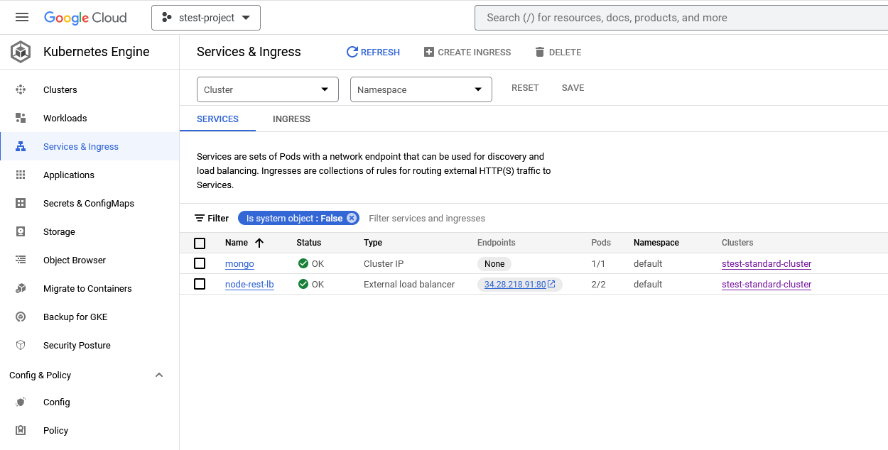
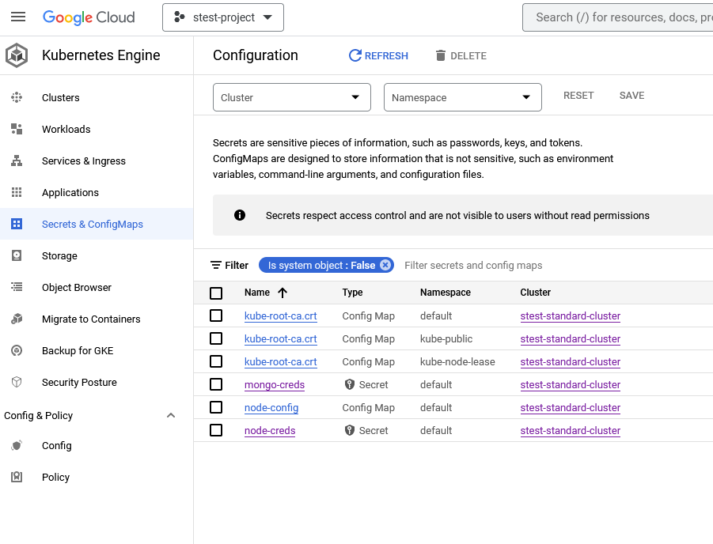
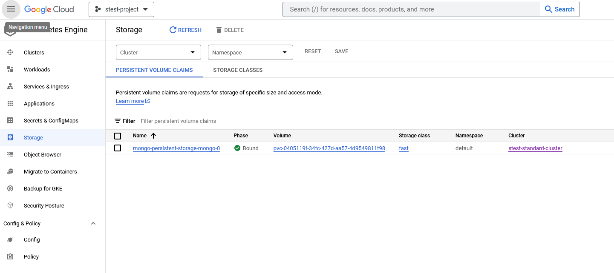

# Problem Statement:
------------------------------------------------------

# Docker hub URL
-----------------------------------------------------------
https://hub.docker.com/repository/docker/theaggarwal/nagp-sa/general

Note: theaggarwal/nagp-sa is repo path of my docker hub.

--------------------------------------
# Steps to setup API project
--------------------------------------
# Before building the image make sure
1. Docker desktop is running on the local
2. command prompt is showing the correct solution path (/api),  where docker file is present.

## step 1: To build the image, use the below command
---------------------------------------------------------------------------------------------------------
> docker build -t theaggarwal/nagp-sa:2 .

## step 2: To run the image on port 4000 (locally on docker destop), use the below command
--------------------------------------------------------------------------------------------------------
> docker run -p 4000:3001  theaggarwal/nagp-sa:2
once run, you can browse the applicaiton using https://localhost:4000
Note: in Index.js port 3001 is used.

## step 3: To push the image to docker hub, use below command.
----------------------------------------------------------------------------------------------------------
> docker push theaggarwal/nagp-sa:2

## step 4:  upload files present in api folder and apply all the yaml files in below order
----------------------------------------------------------------------------------------------------------
kubectl apply -f node-secret-gcp.yaml
kubectl apply -f node-config-map-gcp.yaml
kubectl apply -f node-deployment.yaml
kubectl apply -f node-service.yaml

## Step 5: Verification - Verify no. of pods created and services.
----------------------------------------------------------------------------------------------------------
kubectl get po
kubectl get svc

--------------------------------------
# Steps to setup DB project
--------------------------------------

## Step 1: upload files present in mongo-db folder and run following commands:
----------------------------------------------------------------------------------------------------------
kubectl apply -f secret.yaml
kubectl apply -f ssd.yaml
kubectl apply -f statefulset.yaml

## Credentials used
  password: cGFzc3dvcmQxMjM= //password123
  username: YWRtaW51c2Vy //adminuser

# Snapshots:

# useful commands
1. to get recent logs of pod: kubectl logs --tail=50 <pod-name>
